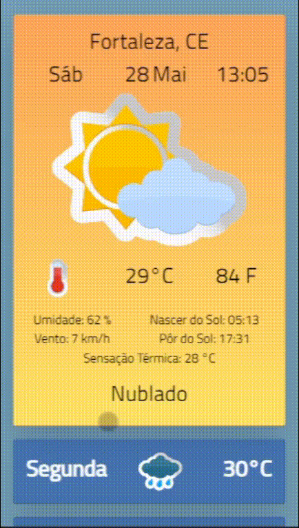

## 💻 Projeto

Gera dados aleatórios de condição do tempo e temperatura, a partir de uma API em ASP.NET Core com Swagger, e o frontend em Javascript puro consome esses dados, modificando a aparência da tela.

## 🎥 Demonstração

## 🔖 Features

- [✔] Background diferente de acordo com a hora do dia
- [✔] API gera valores aleatórios de temperatura e condição do tempo
- [✔] Partes do front mudam de acordo com os dados obtidos da API

## :diamond_shape_with_a_dot_inside: Valores possíveis da API

- Condição do tempo:
    - Céu Limpo 
    - Nublado
    - Chuva
    - Fortes Chuvas
    - Chuvas com Relâmpagos
    - Fortes Chuvas com Relâmpagos

- Temperatura:
    - de 24 a 31 graus Celsius

## 🚀 Como executar

- Clone o repositório `git clone https://github.com/moisesAlc/PrevisaoDoTempo`
- Instale as dependências com `npm install`
- Inicialize a API de backend com `rpm run start-back`
- Agora pode iniciar o front com  `rpm start`
- Atualize a página para receber novos dados

Agora você pode acessar [`localhost:8080`](http://localhost:8080) do seu navegador.

## ❤️ Atribuição de Conteúdo

Os vetores foram retirados do projeto Weather Forecast, criado por macrovector, no site [Freepik](https://www.freepik.com/free-vector/weather-extended-forecast-computer-paper-decorative-widgets-with-sun-clouds-rain-snow-icons-vector-illustration_1158408.htm#page=1&query=weather%20widget&position=1&from_view=search)
